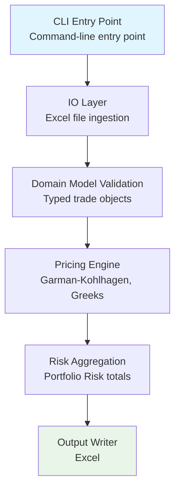

# FX Options Portfolio Risk Aggregator

## Core Objectives

This project implements a modular FX options portfolio risk engine with the following objectives:

- Parse and validate structured FX option trade data from Excel.
- Price European vanilla FX options using the Garman–Kohlhagen model.
- Compute trade-level risk measures (PV, Delta, Vega).
- Aggregate portfolio-level risk metrics.
- Ensure correctness through unit and integration tests.

The focus is on clean architecture, reproducibility, and testability.

---

# Model

Pricing follows the Garman–Kohlhagen (1983) extension of Black–Scholes for foreign exchange options.

Spot is treated as a dividend-paying asset with continuous yield $r_f$.

Forward:

$$
F = S e^{(r_d - r_f)T}
$$

Call price:

$$
C = S e^{-r_f T} N(d_1) - K e^{-r_d T} N(d_2)
$$

Put price:

$$
P = K e^{-r_d T} N(-d_2) - S e^{-r_f T} N(-d_1)
$$

Vega:

$$
\nu = S e^{-r_f T} \phi(d_1)\sqrt{T}
$$

### Model Assumptions

- Constant volatility.
- Lognormal spot dynamics.
- Deterministic domestic and foreign rates.
- Continuous compounding.
- European exercise.
- No transaction costs or discrete hedging error.

---

# Architecture & Design

The system is structured into distinct layers:



## 1. Domain Model (`models.py`)

- Uses **Pydantic** for strict validation and normalisation.
- Converts loosely structured Excel rows into strongly typed `Trade` objects.
- Enforces:
  - Valid option types.
  - Positive notional.
  - Sensible volatility range.
  - Normalised FX pair formatting.

Design principle: **fail fast at the data boundary**.

This prevents invalid data from propagating into pricing logic.

---

## 2. Pricing Layer (`pricing.py`)

- Pure mathematical functions.
- No Excel, CLI, or Pydantic dependencies.
- Implements GK pricing, delta, and vega.

Design principle: **quantitative logic must be isolated and testable**.

This enables:
- Unit testing against financial invariants.
- Easy extension to alternative models.
- Reuse inside an API or service.

---

## 3. Risk Layer (`risk.py`)

- Converts per-unit outputs into trade-level PV, Delta, Vega.
- Aggregates portfolio totals.

Scaling by notional is handled here.

Assumption:
- Notional represents units of the foreign currency.
- PV per unit is multiplied directly by notional to obtain trade PV.

---

## 4. IO Layer (`io_xlsx.py`)

- Responsible only for reading Excel input.
- Returns raw records.
- Delegates validation to the domain model.

Design principle: **separate IO from business logic**.

---

## 5. CLI Layer (`cli.py`)

- Thin orchestration layer.
- Parses arguments.
- Wires IO → validation → pricing → aggregation → output.

Designed so it could be replaced by:
- FastAPI endpoint
- Batch job
- AWS Lambda handler

---

# Scalability, Reliability & Performance

Although this implementation targets small-to-medium portfolios, design choices support scalability:

- Stateless pricing functions (easy to parallelise).
- Clear separation of orchestration from core logic.
- Deterministic outputs (no randomness).
- Explicit validation at input boundary.

Performance considerations:
- Currently trade-level iteration (readable, explicit).
- Can be vectorised or parallelised for large portfolios.
- Pricing layer is independent and suitable for batching.

---

# Data Input Structure

Expected Excel columns:

- `TradeID`
- `Underlying`
- `Notional`
- `NotionalCurrency`
- `Spot`
- `Strike`
- `Vol`
- `RateDomestic`
- `RateForeign`
- `Expiry` (time-to-maturity in years fractions or maturity date)
- `OptionType`

---

# Output Structure

The engine produces:

Trade-level results:
- PV
- Delta
- Vega
- Time to maturity

Portfolio-level results:
- Total PV
- Total Delta
- Total Vega
- Number of trades

Sample output is provided in:

```
outputs/results.xlsx
```

---

# Assumptions (Implementation-Level)

In addition to model assumptions:

- Expiry is provided as time-to-maturity (not calendar date).
- Rates are continuously compounded.
- Vega is reported per 1.0 absolute volatility.
- Notional is treated as foreign currency units.
- No netting across currency pairs.
- No multi-curve framework.
- No smile interpolation.

---

# Unit Tests

The project includes:

1. Validation tests (data integrity).
2. Quantitative consistency tests:
   - Put–call parity.
   - Finite-difference delta validation.
   - Finite-difference vega validation.
3. End-to-end pipeline test.

Run tests with:

```bash
PYTHONPATH=src pytest
```

---

# Dependencies

#### Core libraries:

- `pydantic` (data validation)

- `pandas` (Excel IO)

- `scipy` (normal distribution)

- `pytest` (testing)

The pricing engine itself depends only on `math` and `scipy.stats.norm`.

---

# How to Run

#### 1. Create environment:

```
python -m venv .venv-fxopra
source .venv-fxopra/bin/activate
pip install -r requirements.txt
````

#### 2. Run CLI:

```
PYTHONPATH=src python -m fx_options_portfolio_risk_aggregator.cli \
  --input data/fx_trades.xlsx \
  --output outputs/results.xlsx \
  --valuation-date 2026-02-20 \
  --day-count ACT/365
```

---

# Future Extensions

 - Packaging (`pip install -e .`) instead of `PYTHONPATH`.
 - Vectorised pricing for large books.
 - Support for volatility surfaces.
 - ~Adapat fo valuation-date as its purely cosmetic for now~
 - Introduce configurable day count
